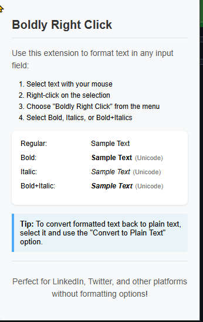

# Boldly Right Click

A Chrome extension that allows you to format text as bold, italic, or both in any browser input field using Unicode characters.

## Features

- Format text as bold, italic, or both using Unicode characters
- Works in any input field across all websites
- Simple right-click menu interface
- Convert formatted text back to plain text
- Perfect for platforms without built-in formatting options (LinkedIn, Twitter, etc.)

## Installation

### From Chrome Web Store (Coming Soon)
*(Link will be added once the extension is published)*

### Manual Installation
1. Download or clone this repository
2. Open Chrome and navigate to `chrome://extensions/`
3. Enable "Developer mode" in the top right corner
4. Click "Load unpacked" and select the extension directory

## Usage

1. Select the text you want to format
2. Right-click on the selection
3. Choose "Boldly Right Click" from the context menu
4. Select your desired format:
   - Bold
   - Italic
   - Bold + Italic
   - Convert to Plain Text (to remove formatting)

## Screenshots

When installing, remember to be in Developer Mode.
You do not need to have it pinned to the extension bar to use

## Examples

- Regular: Sample Text
- **Bold**: **Sample Text**
- *Italic*: *Sample Text*
- ***Bold+Italic***: ***Sample Text***

## Technical Details

- Built using Chrome Extension Manifest V3
- Uses Unicode characters for text formatting
- No external dependencies
- Lightweight and fast

## Contributing

Contributions are welcome! Please feel free to submit a Pull Request.

## License

This project is licensed under the MIT License - see the LICENSE file for details.

## Support

If you encounter any issues or have suggestions, please open an issue in the GitHub repository. 

If you like this extension, feel free to send me a dollar or two on "Buy me a coffee" at https://www.buymeacoffee.com/zeevabrams

